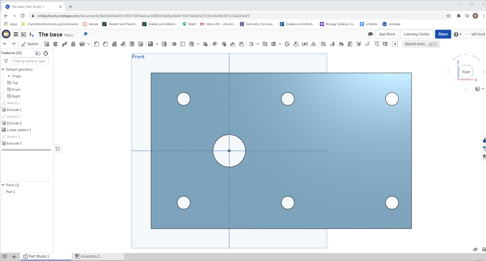
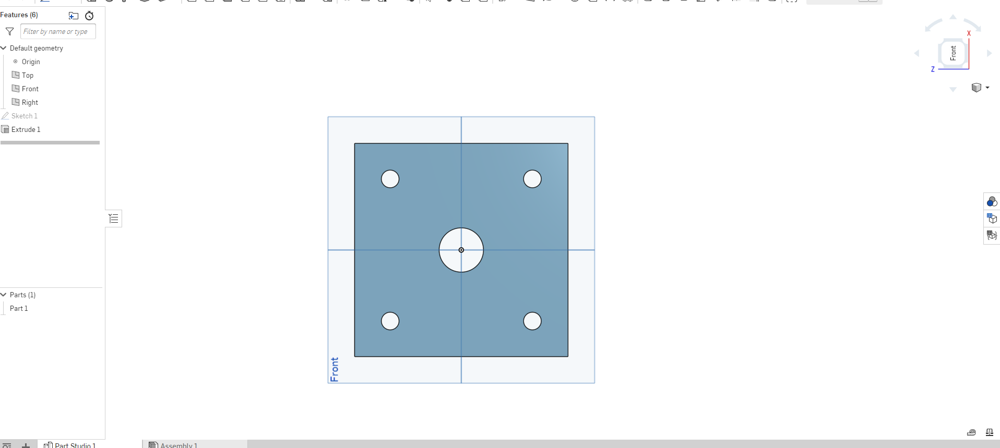
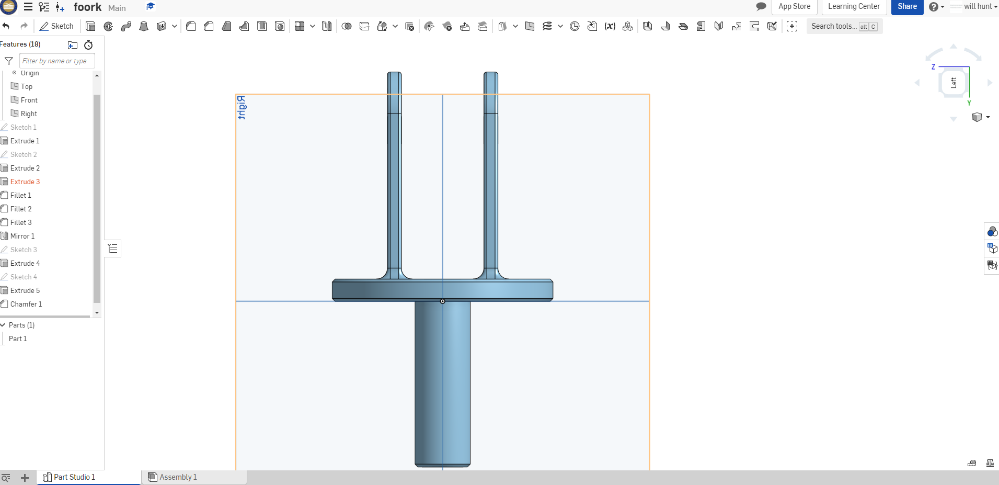

# BASIC-cad

## Assignment 
[The Base](https://cvilleschools.onshape.com/documents/8e2bde5e493e10007c8fc4ab/w/b88603fad6adbd419387d4e6/e/3536c46e86c001254a320ed9)

[The mount](https://cvilleschools.onshape.com/documents/57bf0dfc9d3ff66c8b3f6263/w/21d27be0ab79dfee4de649c0/e/b558de1b4d46b44bd2398de9)

[The Fork](https://cvilleschools.onshape.com/documents/a12a4ca3abc6ce65d41e6806/w/a855c5736b112edff0f30f3a/e/b62831699f895f0cf09ff91a)

[The Tire](https://cvilleschools.onshape.com/documents/907c65746811e3b599c44969/w/e5f93073839f57ba0e314f23/e/cf10da3e43eb5f4b96e8df38)

[The Wheel](https://cvilleschools.onshape.com/documents/e5d4724b5ef65eb14f83933f/w/5a3f2e773e5c37631703fffc/e/b85b33ad881c2e4c788dbb2a)

# picture 

