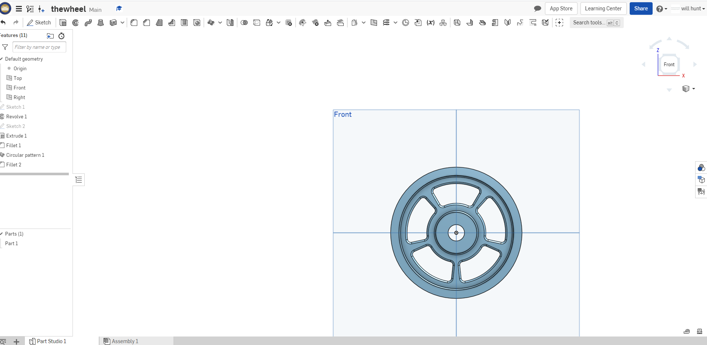
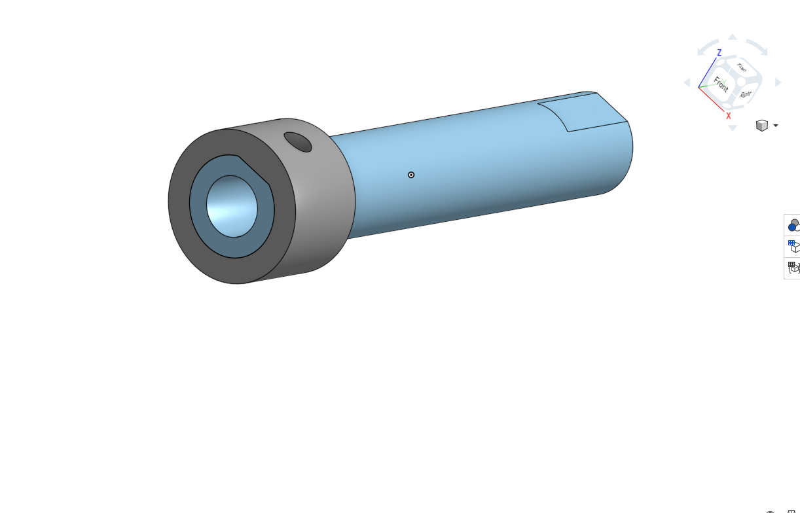

# BASIC-cad

We are creating a caster.

## Assignment 
[The Base](https://cvilleschools.onshape.com/documents/8e2bde5e493e10007c8fc4ab/w/b88603fad6adbd419387d4e6/e/3536c46e86c001254a320ed9)

[The mount](https://cvilleschools.onshape.com/documents/57bf0dfc9d3ff66c8b3f6263/w/21d27be0ab79dfee4de649c0/e/b558de1b4d46b44bd2398de9)

[The Fork](https://cvilleschools.onshape.com/documents/a12a4ca3abc6ce65d41e6806/w/a855c5736b112edff0f30f3a/e/b62831699f895f0cf09ff91a)

[The Tire](https://cvilleschools.onshape.com/documents/907c65746811e3b599c44969/w/e5f93073839f57ba0e314f23/e/cf10da3e43eb5f4b96e8df38)

[The Wheel](https://cvilleschools.onshape.com/documents/e5d4724b5ef65eb14f83933f/w/5a3f2e773e5c37631703fffc/e/b85b33ad881c2e4c788dbb2a)

[The Axle and Collar](https://cvilleschools.onshape.com/documents/221d504666249d849708dc49/w/c233c3d6086ed21052102d41/e/cd1700ef66908ddb52d9eba2)

[Big Bearing](https://cvilleschools.onshape.com/documents/24ef65c5c296e1d60f993bd1/w/23eaebe4227943af16eb5e0d/e/2162aead66d51c773737404e)

# description 
The first assignment is to create the caster base.  The base's dimensions are 200 mm x 120 mm and 8 mm thick.  It has 6 holes 10 mm wide and 20 mm from the edge equally spaced along the edges.

# picture 

